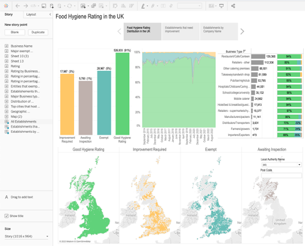

## Food_hygiene_rating_UK

Our health hinges on food hygiene, making local shop hygiene ratings a key interest. This project visualises UK food hygiene ratings, providing an [interactive dashboard](https://public.tableau.com/app/profile/xiao.lai/viz/FoodHygieneRatingUK/FoodHygieneRatingintheUK?publish=yes). Inputting a postcode or council name allows for customised shop queries.

I downloaded UK food hygiene rating data via an API, visualized it in Tableau, and published the report on Tableau Public. Below image shows the hygiene rating distribution in the UK. 

  

